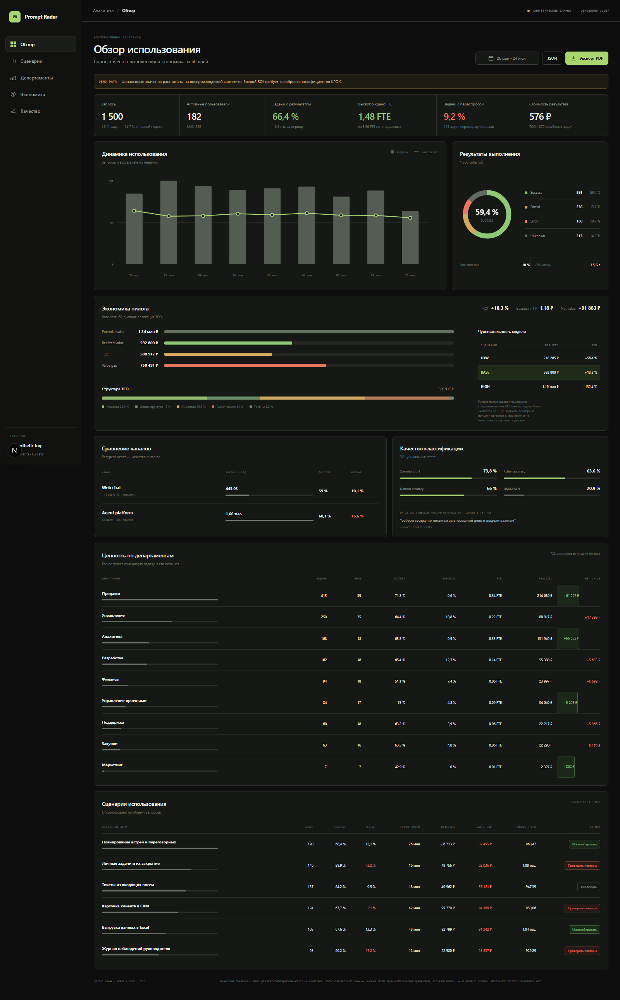

<div align="center">

# Prompt Radar

**Аналитика сценариев и unit-экономики корпоративных ИИ-агентов**

Кейс КРОК «Промпт-радар» · Nuclear IT Hack School

[](https://nextjs.org)
[](https://react.dev)
[](https://www.typescriptlang.org)
[](tests)
[](#архитектура)

</div>

---

> [!IMPORTANT]
> Prompt Radar отвечает не на вопрос «сколько сотрудники потратили токенов», а на вопрос:
> **сколько подтверждённой ценности возвращает один рубль полной стоимости AI и где эта ценность теряется.**

## Демонстрация

<div align="center">

[](artifacts/prompt-radar-demo.mp4)

</div>

| Материал | Ссылка |
| --- | --- |
| Видео работы dashboard, MP4 | [artifacts/prompt-radar-demo.mp4](artifacts/prompt-radar-demo.mp4) |
| PDF с ключевыми метриками | [artifacts/prompt-radar-dashboard.pdf](artifacts/prompt-radar-dashboard.pdf) |
| Полноразмерный скриншот | [artifacts/prompt-radar-dashboard.png](artifacts/prompt-radar-dashboard.png) |

Живой запуск:

```bash
npm install
npm run build
npm start
```

Открыть <http://localhost:3000>. API-ключ не нужен — расчёт полностью воспроизводим на синтетике.

## Задача и как мы её поняли

Кейс требует классифицировать запросы к ИИ-агентам, собрать их в сценарии, объяснить каждый
сценарий и показать результат руководителю. Но за этим стоит вопрос заказчика, который звучал
на разборе кейса прямо: агентская платформа тратит в разы больше токенов, чем веб-чат, и надо
доказать гендиректору, что это выгодно.

Поэтому продукт устроен вокруг одного неравенства:

```text
Realized Value  >  Total Cost of Ownership
```

Токены и вызовы инструментов — это активность и затраты. Сами по себе они не доказывают,
что рабочая задача выполнена.

## Что делает продукт

На входе — OpenAI-compatible запросы и, если доступны, operational traces: результат
выполнения, вызовы инструментов, повторные обращения и feedback.

На выходе:

- классификация каждого запроса по двум независимым осям — действие и домен;
- группировка в устойчивые бизнес-сценарии;
- операционные метрики: MAU, спрос, success, переспросы, ошибки инструментов, латентность;
- **Potential Value → Realized Value → Value Gap → TCO → ROI**;
- разрезы по департаментам, ролям, сценариям и продуктам;
- low / base / high вместо одной недоказуемой финансовой цифры.

```text
OpenAI-compatible payload (десятки тысяч символов с RAG-контекстом)
        ↓
извлечение текущего пользовательского намерения
        ↓
дешёвый детерминированный классификатор → UNKNOWN
        ↓
свёртка переформулировок в задачи + operational outcome
        ↓
Potential × Outcome Yield = Realized
        ↓
Realized − TCO = Net Value
```

## Ключевое различие, которое мы не размываем

Мы не «считаем экономику всей компании по тексту промптов».

Из текста запроса можно оценить только **Potential Value**: какой тип работы пользователь
хотел выполнить и сколько ручного времени такой сценарий обычно занимает. Чтобы говорить о
**Realized Value**, нужны дополнительные сигналы: успешный outcome, tool traces, отсутствие
повторного запроса и feedback.

| Доступные данные | Что можно утверждать |
| --- | --- |
| Только request payload | Potential Value — верхняя оценка пользы |
| Request + tool trace | Probable Value — задача исполнялась, результат не подтверждён |
| Request + outcome + повторы + feedback | Realized Value — консервативная оценка |

## Результат демонстрационного прогона

Синтетический operational log за 60 дней, 1 500 событий, 182 пользователя.

<table>
<tr><td>

**Спрос и качество**

| Метрика | Значение |
| --- | ---: |
| События | 1 500 |
| Задачи | 1 311 |
| MAU | 138 |
| Задачи с результатом | 66,4 % |
| Задачи с переспросом | 9,2 % |
| Ошибки инструментов | 10,0 % |

</td><td>

**Экономика, base case**

| Метрика | Значение |
| --- | ---: |
| Potential Value | 1,34 млн ₽ |
| Realized Value | 592,8 тыс ₽ |
| Value Gap | 750,5 тыс ₽ |
| TCO | 500,9 тыс ₽ |
| Возврат на 1 ₽ | 1,18 ₽ |
| ROI | +18,3 % |
| Высвобождено | 1,48 из 3,36 FTE |

</td></tr>
</table>

Диапазон ROI: **−56,4 % / +18,3 % / +132,4 %**. Пессимистичный сценарий отрицательный, и
интерфейс это показывает: руководитель видит и результат, и риск модели.

Сравнение двух продуктов — тот самый вопрос заказчика:

| Продукт | Запросы | Пользователи | Токенов на запрос |
| --- | ---: | ---: | ---: |
| Веб-чат | 914 | 141 | 443 |
| Агентская платформа | 586 | 41 | **1 657** |

Агент дороже в 3,7 раза на запрос. Сам по себе этот факт ничего не доказывает — правильное
сравнение идёт по стоимости одного успешного результата, и именно её считает Prompt Radar.

> [!WARNING]
> Это демонстрация методики, а не заявление о реальном ROI КРОК. На боевых логах формулы
> сохраняются, но стоимость ручной работы и TCO калибруются заказчиком.

## Методика

### Спрос считается по задачам, а не по событиям

Пользователь, переформулировавший запрос трижды, создал **одну** единицу спроса, а не три.
Поэтому переформулировки сворачиваются в задачу по цепочке `repeatOf`: сценарий берётся у
первой попытки, результат — у последней. Токены всех попыток остаются в стоимости, то есть
переспросы стоят денег и не приносят ценности — но не вычитаются из неё дважды.

### Ручное время задаётся посценарно

У каждого сценария в `taxonomy.json` своя экспертная оценка ручного выполнения: от 12 минут
на заметку о сотруднике до 95 минут на аналитику компании по открытым источникам.
Средневзвешенное по фактическому спросу — 24,6 минуты на задачу. Плоское среднее завысило бы
потенциал, поэтому его нет.

Нераспознанные запросы получают оценку самого дешёвого известного сценария: UNKNOWN не должен
уметь раздувать бизнес-кейс.

### Формулы

```text
Potential Minutes = Σ по сценариям (задачи × ручное время сценария)

Outcome Yield = Success Factor × (1 − Review Rate) × Feedback Factor

Realized Value = Potential Minutes × Outcome Yield × стоимость минуты
Value Gap      = Potential Value − Realized Value
Net Value      = Realized Value − TCO
ROI            = Net Value / TCO
FTE-months     = Realized Minutes / (рабочих часов в месяце × 60)
```

```text
TCO = токены × цена за 1000
    + амортизация инфраструктуры
    + лицензии
    + команда разработки и эксплуатации
```

Команда не входит в маржинальную стоимость токена, но обязательно входит в TCO отдельной
строкой — это предотвращает двойной счёт. Если `TCO = 0`, ROI не вычисляется и показывается
как «нет данных», а не `Infinity`.

Часть величин измеряется в логах, часть явно задаётся как предположение с диапазоном
low / base / high. Интерфейс не смешивает эти уровни доказательности.

## Извлечение намерения

Боевой payload корпоративного RAG-шлюза — это десятки тысяч символов: системный промпт,
история диалога и целые документы, подмешанные к вопросу. Если классифицировать payload
целиком, получится категория документа, а не задача пользователя.

Prompt Radar извлекает текущий вопрос:

1. последнее содержимое `<user_query>`;
2. пользовательский текст вне `<context>` и `<source>`;
3. последний содержательный `user` message.

На демонстрационном payload: **22 262 символа → 58 символов, сжатие в 384 раза**, после чего
запрос корректно уходит в сценарий «Сводка за день по почте».

Материалы заказчика в репозиторий не попадают, поэтому в `src/data/synthetic/rag-payload-sample.json`
лежит синтетический аналог той же структуры.

## Датасет

Датасет разделён на два слоя.

1. **188 уникальных запросов с gold-разметкой** проверяют качество извлечения и классификации.
   Тысячи почти одинаковых перефразов искусственно завысили бы accuracy.
2. **1 500 operational events** моделируют 60 дней работы: даты, пользователи, департаменты,
   роли, агент, токены, вызовы инструментов, outcome, повторы и feedback. Этот слой нужен для
   трендов и экономики.

Gold labels не передаются анализатору и применяются только после предсказаний.

| Метрика классификации | Значение |
| --- | ---: |
| Scenario top-1 accuracy | 73,8 % |
| Action accuracy | 63,6 % |
| Domain accuracy | 66,0 % |
| Доля UNKNOWN | 20,9 % |

UNKNOWN — не ошибка, а честный отказ угадывать. Это точка подключения LLM: клиент к
OpenAI-compatible модели реализован и покрыт тестами, но в текущем прогоне каскад работает без
модели, чтобы результат был полностью воспроизводимым.

## Быстрый старт

Требуется Node.js 22+.

```bash
npm install
cp .env.example .env.local
npm run dev
```

| URL | Что там |
| --- | --- |
| <http://localhost:3000> | основной checkpoint |
| <http://localhost:3000/checkpoint> | прямой URL того же экрана |
| <http://localhost:3000/api/checkpoint> | исходный JSON расчёта |
| <http://localhost:3000/api/health> | health check |

## Команды

```bash
npm run generate:dataset  # заново собрать operational log
npm run check             # lint + TypeScript + 27 тестов
npm run build             # production build
npm run dev               # локальная разработка
```

## OpenAI-compatible модель

Проект не привязан к провайдеру. Подойдёт локальная модель или совместимый внешний endpoint:

```dotenv
AI_BASE_URL=
AI_API_KEY=
AI_CHAT_MODEL=
AI_EMBEDDING_MODEL=
```

LLM не должна обрабатывать каждый запрос. Очевидные intent проходит дешёвый детерминированный
классификатор, в модель имеет смысл отправлять только UNKNOWN и низкоуверенные случаи. Это
снижает стоимость анализа и делает основную маршрутизацию воспроизводимой. Ключ провайдера
никогда не попадает в клиентский код.

## Архитектура

MVP — одно приложение на Next.js 16 / React 19 / TypeScript:

- server route читает compact JSONL и выполняет расчёт;
- чистые функции извлекают intent, классифицируют, сворачивают задачи, агрегируют и считают ROI;
- результат кэшируется в процессе;
- браузер получает только готовый checkpoint JSON;
- база данных, Python и тяжёлые ML-библиотеки не нужны.

Боевой источник данных — экспорт или адаптер корпоративного AI gateway / OpenTelemetry.

```text
src/
  app/
    api/checkpoint/       воспроизводимый server-side расчёт
    checkpoint/           основной интерфейс
  data/synthetic/         taxonomy, gold labels, variants, operational log
  lib/
    analytics/            intent, classifier, tasks, aggregate, ROI
    contracts/            Zod-контракты входных и выходных данных
    providers/            OpenAI-compatible HTTP client
scripts/                  генератор синтетического operational log
tests/                    контракты, аналитика, провайдер и dataset
docs/                     архитектура, методика, глоссарий и сценарий защиты
artifacts/                видео, PDF и скриншот dashboard
```

## Документация

| Документ | О чём |
| --- | --- |
| [docs/methodology.md](docs/methodology.md) | методика расчёта и уровни доказательности |
| [docs/pitch.md](docs/pitch.md) | сценарий защиты и ответы на вопросы |
| [docs/checkpoint.md](docs/checkpoint.md) | порядок демонстрации |
| [docs/architecture.md](docs/architecture.md) | архитектура и каскад классификации |
| [docs/dashboard-glossary.md](docs/dashboard-glossary.md) | что означает каждая метрика на экране |
| [docs/project-context.md](docs/project-context.md) | контекст кейса и требования заказчика |

## Ограничения MVP

- текущие финансовые результаты получены на синтетике;
- ручное время и review rate требуют интервью и калибровки на стороне заказчика;
- нет постоянного хранилища и многопользовательской авторизации;
- таксономия закрытая: baseline распознаёт 16 сценариев, выведенных из тем заказчика, а
  новые паттерны пока попадают в UNKNOWN и требуют LLM-разбора;
- саммаризация сценариев ограничена названием, описанием и метриками группы;
- отсутствие outcome позволяет показывать Potential, но не доказывает Realized Value.
